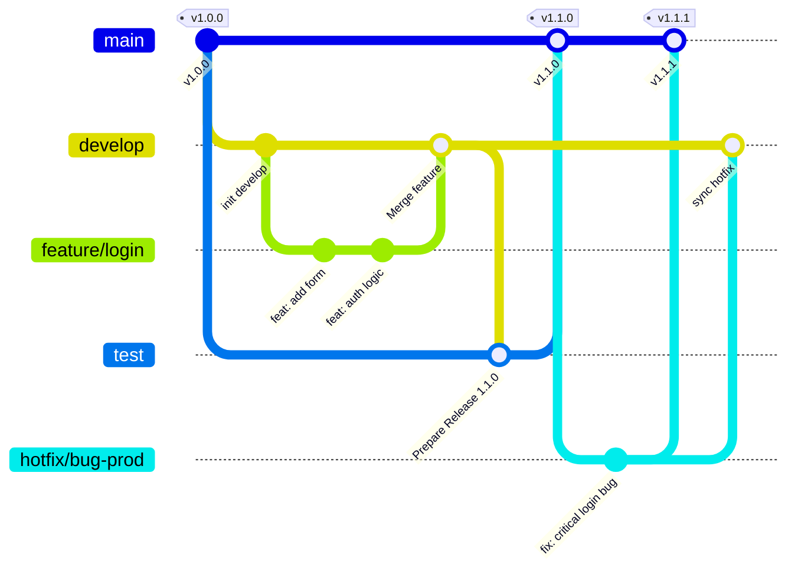

# 📑 Documentação de Fluxo de Trabalho e Versionamento

Este documento estabelece as normas para o desenvolvimento colaborativo, garantindo a estabilidade dos ambientes de **Desenvolvimento**, **Staging** e **Produção**.

---

## 🏗 Estratégia de Branches (Git Flow Simplificado)

O projeto utiliza um modelo de ramificação baseado em estados de prontidão do código.

### 1. Branches Permanentes
* **`production`**: Reflete o código em estado "live". Apenas recebe merges da `test`. Cada merge gera uma nova versão (Tag).
* **`test`**: Ambiente de homologação. Onde o QA e o cliente validam as entregas antes do deploy final.
* **`develop`**: Branch de integração. Todo desenvolvimento finalizado converge para cá.

### 2. Branches de Suporte
* **`feature/*`**: Para novas funcionalidades. Criada a partir da `develop`.
* **`hotfix/*`**: Para correções críticas em produção. Criada a partir da `production`.

---

## 🎨 Fluxo Visual (Gitflow Diagram)

Abaixo, a representação de como o código viaja entre as branches:

> **Nota:** No diagrama acima, `main` representa a sua branch de `production`.

---